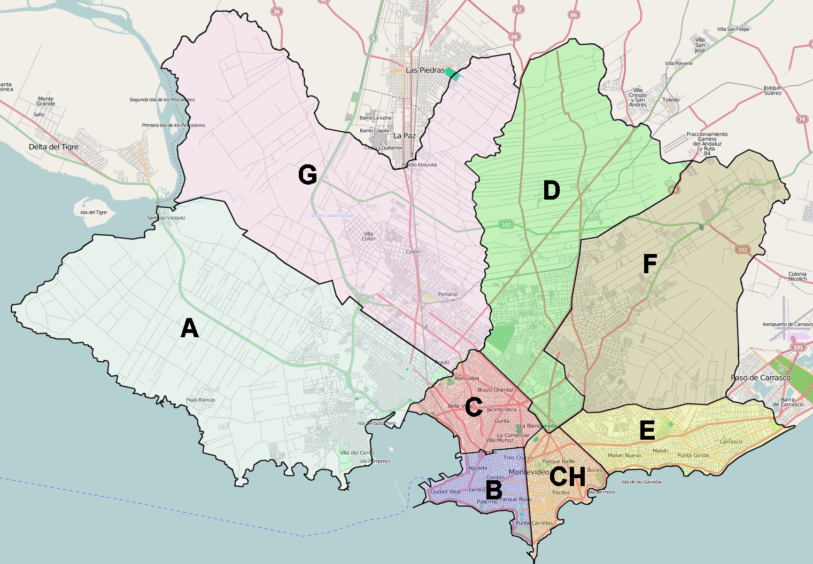

<!-- Cambia la el prefijo de gráficos y tablas -->
\captionsetup[figure]{name=Gráfico}
\captionsetup[table]{name=Tabla}


<!-- Saca la indentacion de los parrafos -->
\setlength{\parindent}{0pt}

<!-- Pone encabezado en cada página-->
\renewcommand{\headheight}{0.6in}
\setlength{\headwidth}{\textwidth}
\fancyhead[R]{\small\emph{\textcolor{blue}{Unidad de Estad\'istica- Intendencia de Montevideo}}}
\pagestyle{fancy}


<!-- \tableofcontents -->
<!-- \newpage -->

<!-- Tablas de figuras y cuadros -->
\listoftables
\listoffigures

<!-- Salto de página -->
\newpage

```{r setup, echo = F,include=T}
knitr::opts_chunk$set(echo = T,message = F,warning = F,
                      eval = T,fig.align="center",out.width = "50%")
                      #fig.caption = "Gráfico: ")

## Preambulo: no incluido por problemas de PC locales (probar c/u si funciona)
# - \usepackage{tilting}
# - \pretitle{\begin{center}
#   \includegraphics[scale=0.5]{IM_logo_2021.png}
# - \posttitle{\end{center}}

```


# Intro

En este ejercicio se volverá a trabajar con el archivo "Reporte.Rmd" que se trabajó durante la clase anterior.

_Importante_ guardar archivo en lugar de fácil acceso para ustedes, ej `Mis Documentos/Curso R`. 

(_Nota_: si no cuentan con este archivo, pueden generar un nuevo Rmd utilizando la plantilla por defecto de RStudio, navegando a: File >> New file >> RMarkdown)


# Parte 1: modificación de `Reporte.Rmd`

- Borrar **TODO** desde el fin del preámbulo YAML (esto es, luego de los tres guiones finales '---') hacia abajo

- Cambiar nombre: guardar archivo en carpeta indicada como `03_Ejercicio.Rmd`

- _Agregados en YAML_: en el preámbulo YAML se agregarán:

  + "Ejercicio para practicar RMarkdown" en el título (`title`)

  + Nombre y apellido de quien lo escribe en espacio de autoría (`author`)
  
  + Fecha del día en que se realiza este ejercicio (`date`)
  
  + **[EN DUDA]** Agregar logo de la Intendencia de Montevideo, según las especificaciones establecidas en el [manual de identidad institucional](https://montevideo.gub.uy/sites/default/files/biblioteca/manualim_0.pdf)

<!-- problema: tilting.sty not found POR TENER tinytex Y MikTeX; Sol 1) tinytex::parse_install(<mensaje_de_error>), tinytex::parse_install(text="! LaTeX Error: File `tilting.sty' not found.") o 2) tinytex:::install_prebuilt() + tinytex::parse_install(<mensaje_de_error>)

-->

  + Tamaño del cuadro de texto: se usarán márgenes (`geometry`) así:
    - Izquierda: 2cm
    - Derecha: 2cm
    - Arriba: 2.5cm
    - Abajo: 2.2cm

- _Agregados debajo del preámbulo YAML_ (y antes de comenzar el resto del documento)

  + Cambiar el prefijo por defecto de las figuras por la palabra `gráfico`

  + Cambiar el prefijo por defecto de los cuadros por la palabra `tabla` 
  
  + Agregar índice de contenidos
  
  + Agregar salto de página antes de comenzar el texto

- Agregar chunk de configuración inicial llamado _setup_ con estas características:

  + Parámetros seteados TRUE: _echo_ (muestra código en salida) _eval_ (evalúa código)
  
  + Parámetros seteados FALSE: _message_ (muestra mensajes) _warning_ (muestra advertencias)
  
  + Figuras: centradas y con ancho a la mitad del tamaño del documento

<!-- echo = T,message = F,warning = F, -->
<!--                     eval = T,fig.align="center",out.width = "50%" -->


# Parte 2: agregados de texto e imágenes

## Datos ECH

A partir de aquí se usarán los datos trabajados en el Ejercicio 2, donde se realizaron algunas operaciones con información proveniente de la Encuesta Contínua de Hogares (ECH), realizada por el Instituto Nacional de Estadística (INE).

En primer lugar, levantar los datos guardados en formato RData en la carpeta `Resultados`. (_Nota_: para establecer la ruta correcta probar con: `"../Resultados/misRes.RData"`)


```{r, echo=TRUE,warning=FALSE,eval=TRUE}
# Cargo paquetes
library(tidyverse)
library(knitr)

# Levanto datos
load("../M3-Manipulacion/Resultados/misRes.RData")
```

## Imagen: mapa de Montevideo

Agregar al informe un mapa de Montevideo con los municipios demarcados. Sugerimos utilizar el mapa realizado para [Wikipedia](https://es.m.wikipedia.org/wiki/Archivo:Municipios_of_Montevideo.png)

```{r, echo=TRUE,warning=FALSE,eval=TRUE}
#include.graphics()

```

Agregar nota al pie con la dirección URL que contiene al mapa. 

<!-- nota al pie^[[Fuente: Wikipedia](https://es.m.wikipedia.org/wiki/Archivo:Municipios_of_Montevideo.png)] -->

## Tabla

Extraer de la lista denominada `mi_lista` su primer componente. Con éste seleccionar estas variables: `municipio`, `totCasos`, `VInMed_porc`, `auto_porc` y ordenar de forma decreciente por `VInMed_porc`. Guardar ese resultado en un nuevo objeto, `tbl`.

Mostrar resultado en tabla con función `kable` y utilizando el paquete `kableExtra`, con los siguientes agregados:

- Formato: centrada, fuente tamaño 8; primer fila (nombres de cada columna) con letra en negrita y color rojo

- Leyenda: "Viviendas medio inadecuadas e inadecuadas y proporción de hogares con autos, por municipio


```{r, echo=TRUE,warning=FALSE,eval=TRUE}
library(kableExtra)
#sacate algo de clases anteriores

tbl <- mi_lista[[1]] %>% select(c(municipio, TotCasos, VInMed_porc, auto_porc)) %>% 
  arrange(desc(VInMed_porc))
colnames(tbl) <- c("Municipio","Casos","%Viv Medio-Inadecuadas","%Auto")

kable(tbl, booktabs=TRUE, caption="Viviendas medio inadecuadas e inadecuadas y proporción de hogares con autos, por municipio") %>% 
  kable_styling(full_width = FALSE,font_size = 8,
                latex_options = c("striped","hold_position"),
                position = "center") %>%
  column_spec(1,bold = TRUE) %>% 
  row_spec(0,bold = TRUE,color = 'red')


```


## Gráfico

Realizar un gráfico de barras vertical de la variable `ht13_rec`, creada en el ejercicio 2, con las siguientes características:

- Ejes:

  + Abscisas (OX, eje horizontal): municipio

  + Ordenadas (OY, eje vertical): cantidad (cant)
  
- Color de relleno de barras: azul

- Agregar etiquetas de cantidad de observaciones (cant) encima de cada una de las barras, con tamaño de fuente 3

- Realizar facetas usando la variable `ht13_rec`


```{r, echo=TRUE,warning=FALSE,eval=TRUE}

dat %>% group_by(municipio,ht13_rec) %>% summarise(cant=n()) %>%
#grafico
  ggplot(aes(x=municipio,y=cant)) +
  geom_bar(stat ='identity', fill='blue') +
  facet_wrap(~ht13_rec,ncol=4) +
  geom_text(aes(label=cant),vjust=0,size=3)

```

