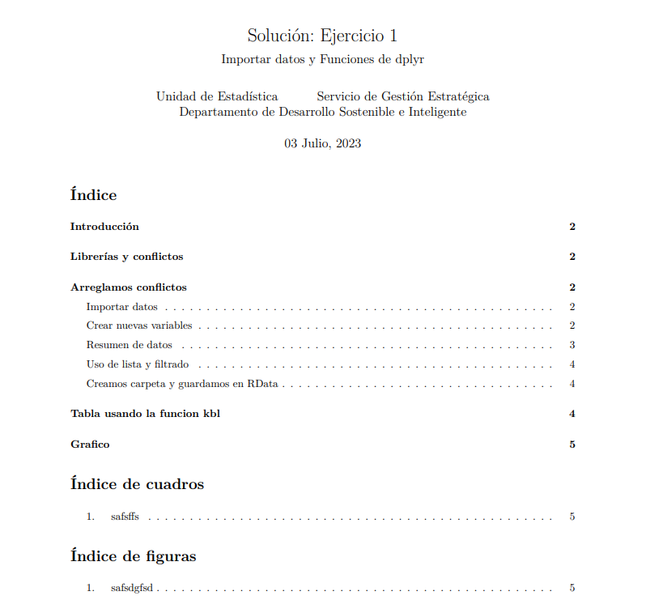
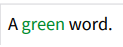
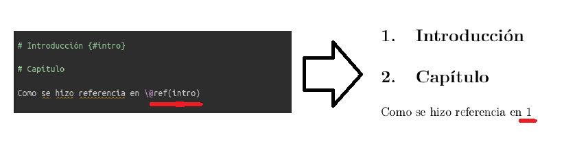

class: inverse, center, middle

# Generación de reportes automáticos utilizando `Rmarkdown` + `knitr`


```{r setup, include=FALSE,warning=FALSE,message=FALSE,echo=FALSE,results='hide'}
options(htmltools.dir.version = FALSE)
library(tidyverse)
library(knitr)
```

<!-- Diapo 1: preparamos todo pa trabajar -->
<!-- Bajar archivos en Moodle, instrucciones CLARAS -->
<!-- 2 chunks: 1 {eval = F}, 2 {eval = T,warning=F,message=FALSE,echo = F,results='hide'} ADENTRO VA LO MISMO!! -->


---

# Repaso: visto hasta ahora

- ### Introducción / conceptos básicos: aprendimos
 + Qué es `R`, interfaz gráfica `RStudio`
 + **RMarkdown: estructura básica**
 + Elementos: objetos, estructura, accesibilidad, operadores
 + Objetos: `vector`es, `data.frame`, `list`as,...
 
- ### Manipulación de datos: 
 + Importación y Exportación de datos 
 + tuberías o _pipes_ `%>%`
 + `dplyr`: verbos (`mutate`,`filter`,`group_by`,`summarise`...), funciones (`mutate_at/if`,`summarise_at/if`,`across`...)
 + `tidyr`: `joins` para juntar datos, `pivot` para cambiar formas...
 
- ### Visualización: `ggplot` _grammar of graphics_ (gráfico en varias etapas) 


<!-- TEMAS DEFINIDOS EN PLANIFICACION
Parte 1:
Generación de reportes automáticos utilizando Rmarkdown + knitr:
 -Definición Rmarkdown
 - Configuración del entorno
 - Texto
 - Código R
 - Configuración de chunks
 - Texto con código R incrustado
Parte 2:
- Configuraciones avanzadas para gráficos y tablas dentro del informe
-->

<!-- --- -->

---

# ¿Qué veremos hoy?: **reportes con `RMarkdown` y `knitr`**

--

¿Qué es `RMarkdown`? Origen en [_Programación Literaria_](https://es.wikipedia.org/wiki/Programaci%C3%B3n_literaria) (D.Knuth 1984): texto ordenado como quiere quien lo escribe (y no la máquina), buscando mezclar narrativa y código informático

_RMarkdown_: Markdown enriquecido, pensado para documentos técnicos (tablas, notas al pie, ecuaciones, referencias bibliográficas, citas, etc.)

--

- ### Markdown
  + `Lenguaje de marcado`: se agregan "marcas" (o etiquetas) al texto para enriquecerlo
  + `Uso muy extendido`: ej. WhatsApp

--
  
- ### `knitr`
  + Paquete de `R` que lo `vincula` con Markdown
  + Transforma código `R` en lenguajes de documentación, permitiendo `reproducibilidad`

--

- ### Pandoc
  + `Pandoc`: conversor de documentos Markdown a otros formatos (PDF, HTML, DOC, ....)
  + Mirar ventana `Render`...

<!-- 4) Datos anidados: crear columnas-listas (no más de esto) -->
Rmd >>knitr>> Markdown >>Pandoc>> compilación: HTML, PDF, DOC, etc

---

class: inverse, center, middle

# Ejemplo de principio a fin

---


---


---


---


---


---


**ADVERTENCIA:** si al compilar en PDF da error, realizar estos pasos en la _consola_ de `R`:

1. `install.packages("tinytex")`

2. `tinytex::install_tinytex()` (demora unos minutos en instalarse)

---


---

# Anatomía de un RMarkdown


---

class: inverse, center, middle

# Preámbulo

---

## Metadatos del documento: YAML

--

`Formato general` del documento: título, autor/a, tipo de documento (ej: html_document, pdf_document, word_document...), adornos

--

.pull-left[
- ### Por defecto
  + Parámetros pedidos al iniciar archivo
  + Se pueden agregar más
]

--
  
.pull-right[  

]

--

.pull-left[
- ### Agregamos como ejemplo:
  + Fecha con código `R` (solo mes y año)
  + Ajustamos tamaño de página en documento
  + Agregamos logo IM  
]

--
  
.pull-right[  

]

---

.pull-left[
## Antes:


]

.pull-right[
## Después:


]

---

## Encabezado `YAML` + `Latex`

.pull-left[

]

.pull-right[

]

--

- Agregando **toc: yes** y **toc_depth: 2** le estamos agregando un índice con profundidad 2 al documento
- Podemos incluir paquetes de latex para configurar algunas cosas: 
  - **\\usepackage\[spanish\]\{babel\}** para configurar el idioma.
  - **\\usepackage\{caption\}** para cambiar el prefijo de tablas y figuras.

---

# Configuración inicial

Chunks `R` al inicio del documento (se puede modificar en cada chunk)


---

class: inverse, center, middle

# Texto

---

## Markdown


### Formatos

--


---

### Listas
#### `Sin orden`: `*` `-` `+`
  

  
---

### Listas
#### `Ordenadas`: 1,2,3
  


---

### Listas
#### `Anidadas con y sin orden`
  


---

### Hipervínculos y Notas al pie

- Los Hipervínculos se ponen entre signos de mayor y menor (`<url>`), si no queremos que se muestre la url se le agrega un nombre entre parentesís rectos y la url entre parentesis curvos `[nombre](url)`. Si queremos que las url salgan con un color distinto dentro del encabezado YAMAL se agrega, por ejemplo, `urlcolor: blue`


### Nota a pie: texto^[Nota_al_pie]


---

## Markdown

### Expresiones matemáticas

Ecuaciones entre `$`: `$e^{i\pi}+1=0$` devuelve $e^{i\pi}+1=0$

Ecuaciones en bloque entre `$$`: la expresión 

\$$\left( \sum_{k=1}^n a_k b_k \right)^2 \leq \left( \sum_{k=1}^n a_k^2 \right) \left( \sum_{k=1}^n b_k^2 \right)\$$


devuelve la desigualdad de Cauchy-Schwarz:
$$\left( \sum_{k=1}^n a_k b_k \right)^2 \leq \left( \sum_{k=1}^n a_k^2 \right) \left( \sum_{k=1}^n b_k^2 \right)$$

---

## Markdown

### Tablas

.pull-left[

> | Right | Left | Default | Center |
>
|-------:|:------|-----------|:---------:|
>
| 12 | 12 | 12 | 12 |
>
| 123 | 123 | 123 | 123 |
>
| 1 | 1 | 1 | 1 |
]

.pull-right[

| Right | Left | Default | Center |
|-------:|:------|-----------|:---------:|
| 12 | 12 | 12 | 12 |
| 123 | 123 | 123 | 123 |
| 1 | 1 | 1 | 1 |

]

---

## Otras herramientas para introducir y mejorar texto

### $\LaTeX$

Podemos crear un \textbf{texto} con agregados en \LaTeX usando expresiones entre `$`:

Podemos crear un $\textbf{texto}$ con agregados en $\LaTeX$ usando expresiones entre `$`

### CSS

Necesario agregar opción `css` al preámbulo YAML


.pull-left[

...  
output: html_document  
  css: "style.css"  

]


.pull-right[
A [green]{.my-color} word. 

devuelve



]


---

class: inverse, center, middle

# Código `R` y chunks

---

## Código `R` dentro de texto

--

.pull-left[
### Expresión: 
\`   `r` `codigo_R`  \`

El data.frame iris tiene \` `r` `nrow(iris)` \`  \` filas  y \` `r` `ncol(iris)` \` columnas
]

--

.pull-right[
El data.frame iris tiene `r nrow(iris)` filas y `r ncol(iris)` columnas
]

--

## Chunks de código `R`

Los chunks son trozos de código que pueden ser ejecutados una vez compilado el documento. Con éstos se puede

+ Configurar documento

+ Insertar imágenes, gráficos, etc.

+ Mostrar resultados de código `R`

---

## Chunks de código `R`


-- 

```{r, warning=FALSE,message=FALSE,echo=FALSE}
a <- read.csv("Rchunks_parametros.csv",sep="\t",header=TRUE,fileEncoding="UTF-8")
#readr::read_delim("Rchunks_parametros.csv",delim="\t") 
a %>%
  kable(booktabs=TRUE,
        col.names=c("Parámetro","Valor por defecto","Qué hace")) %>%
  kableExtra::kable_styling(latex_options="striped")
```


---


class: inverse, center, middle

# RMarkdown avanzado

---


## Tablas con `kable` 

### Generador de tablas simples
  + Función dentro de paquete `knitr`
  + Permite generar tablas provenientes de _datos *rectangulares*_ (matrices, `data.frames`)
  + Código interno generado en $\LaTeX$

--

```{r, eval=FALSE,warning=FALSE,message=FALSE,echo=TRUE,results='markup'}

iris <- iris[1:4,]

#Insertamos tabla simple con knitr::kable()
kable(iris,
      caption="Extracto de datos Iris")

```

--

```{r, eval=TRUE,warning=FALSE,message=FALSE,echo=FALSE,results='markup'}

iris <- iris[1:4,]

#Insertamos tabla simple con knitr::kable()
kable(iris,
      caption="Extracto de datos Iris")

```

---

## Tablas con `kable` 

### Mejoras a tablas
  + Posibilita algunas mejoras en apariencia
  + Parámetros: alineación, formato, cantidad decimales,...

--

```{r, eval=FALSE,warning=FALSE,message=FALSE,echo=TRUE,results='markup'}

iris <- iris[1:4,]

#Insertamos tabla simple con knitr::kable(); agregamos mejoras
kable(iris,
      caption="Extracto de datos Iris",
      align="c", #alineacion central
      booktabs=TRUE, #elimina cuadriculado
      col.names=c("Largo Sepalo","Ancho Sepalo","Largo Petalo","Ancho Petalo","Especie"), 
      format="latex") #genera tabla con codigo Latex

```

--


---

## Tablas mejoradas con `kableExtra` 

### Extensión de funcionalidades de `knitr::kable()`
  + Paquete que mejora cuestiones estéticas de tablas kable
  + Ventaja: funcionalidad aplica para salidas HTML y PDF por igual

--
  
```{r, eval=FALSE,warning=FALSE,message=FALSE,echo=TRUE,results='markup'}
library(kableExtra)
#Insertamos tabla simple con knitr::kable()
kable(iris,
      caption="Extracto de datos Iris",
      align="c", #alineacion central
      booktabs=TRUE, #elimina cuadriculado
      col.names=c("Largo Sepalo","Ancho Sepalo","Largo Petalo","Ancho Petalo","Especie"), 
      format="latex") %>%
      kable_styling(latex_options="striped") 

```

--


---

## Tablas mejoradas con `kableExtra` 

### Más funcionalidades

- Fijar posición de tabla en documento: 

- Fijar estética por filas/columnas
  + Fila: `kable_styling() %>% row_spec(2:5,height="4cm")`
  + Columna: `kable_styling() %>% column_spec(2,width="10cm")`

- Tamaño de fuente: `kable_styling(font_size=8)` 

- Agregar nota al pie: `kable_styling() %>% footnote(...)` 

---

## Imágenes 

### Parámetros gráficos en chunk

Dentro del encabezado del chunk, estos parámetros comienzan con `fig.`

```{r parGraf, warning=FALSE,message=FALSE,echo=FALSE}
a <- read.csv("Rchunks_imagenes.csv",sep="\t",header=TRUE,fileEncoding="UTF-8")
#readr::read_delim("Rchunks_parametros.csv",delim="\t") 
a %>%
  kable(booktabs=TRUE,
        col.names=c("Parámetro","Qué hace","Ejemplo")) %>%
  kableExtra::kable_styling(latex_options="striped")
```

---

## Imágenes 

### Incluir imágenes con `include.graphics()`

- Función del paquete `knitr` que permite agregar imágenes en chunk

- Resto de parámetros (altura, ancho, alineación, etc.) se controlan desde el preámbulo del chunk


---

## Referenciar documentos

--

### Referencias internas

  + Formas de citar un documento como referencia o fuente de otro
  
  + Permite unir documentos en mismo texto para facilitar su ubicación

  + Importante: instalar paquete `bookdown` e indicar en preámbulo YAML convenientemente:

>    
...   
output:   
   bookdown::pdf_document2    
    

--
  
- ### Referencias cruzadas

  + Sección
  
  + Tabla
  
  + Imagen


---

## Referencias cruzadas para secciones


Se referencia con `#` la sección de interés y se la llama en el documento utilizando `\@ref(seccion)`



---

## Referencias cruzadas para tablas

- Necesario darle nombre al chunk donde se encuentra la tabla

- Debe hacerse entre enseguida de la primer `r`: `{r XXX, ...}`


Código en informe Rmd:


Como se ve en el archivo compilado:


---

## Referencias cruzadas para imágenes

- Fundamental agregar parámetro `fig.cap=...` en el chunk

- Para imágenes incluidas con knitr::include_graphics() se utiliza `\@ref(nombre_chunk)`


<!-- , en otros casos `\ref{nombre_chunk}`  -->
  
---

## Bibliografía adicional recomendada

--

- ### [Cheatsheet (guía) RMarkdown](https://posit.co/wp-content/uploads/2022/10/rmarkdown-1.pdf)

--

- ### ["Libro de cocina" (cookbook) de RMarkdown](https://bookdown.org/yihui/rmarkdown/)

--

- ### [Más guías para utilizar R y RStudio](https://posit.co/resources/cheatsheets/)

--

- ### [R para Ciencia de Datos (en español)](https://es.r4ds.hadley.nz/)

--

- ### [Quarto: próxima generación de documentos  RMarkdown](https://quarto.org/docs/computations/r.html)


```{r, eval=TRUE,warning=FALSE,message=FALSE,echo=FALSE,results='markup'}
# Cambiamos los NA en x2 por el valor 458:
#df1 %>% replace_na(list(x2=458)) 

```


<!-- [Wrangle] https://dcl-wrangle.stanford.edu/pivot-basic.html -->

<!-- # Titulo: funcion() -->

<!-- Presentación de funciones -->

<!-- Que hace: marcar con **negrita** lo importante -->

<!-- Utilidad -->

<!-- - Nivel 1 -->
<!--   + Nivel 1a -->
<!--   + Nivel 1b -->
<!-- - Nivel 2 -->
<!--   + Nivel 2a -->
<!--   + Nivel 2b -->

<!-- Dos funciones relacionadas: a | b -->
